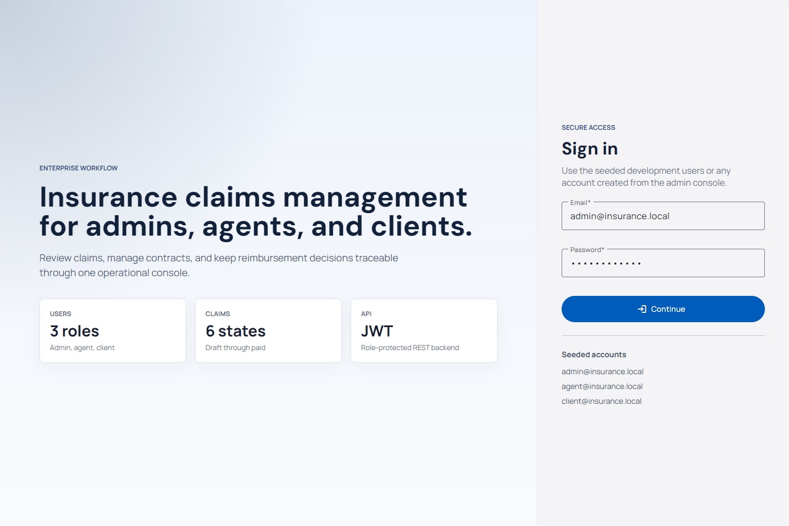
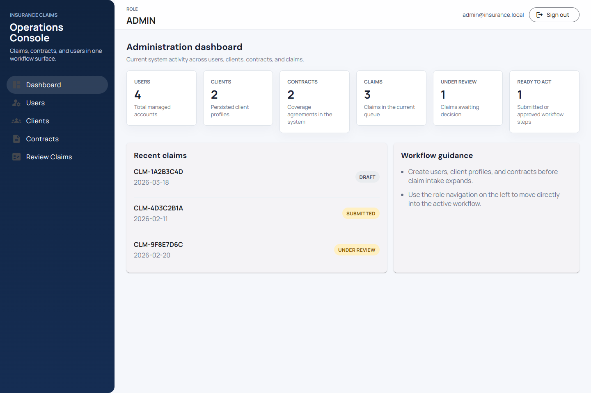
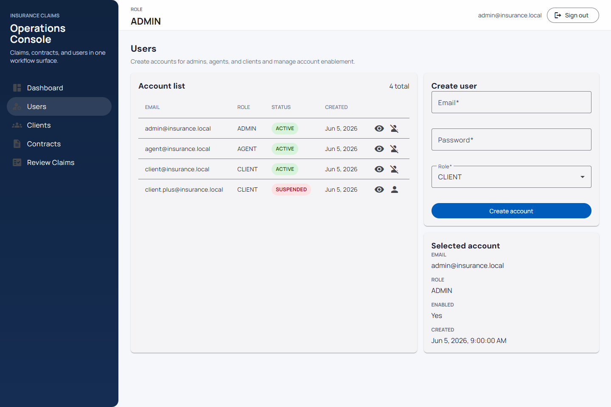
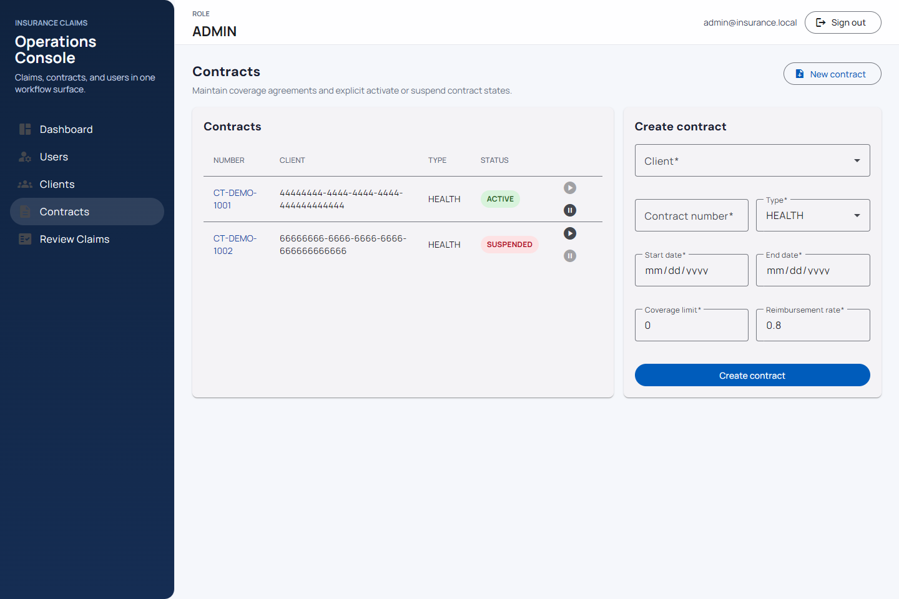
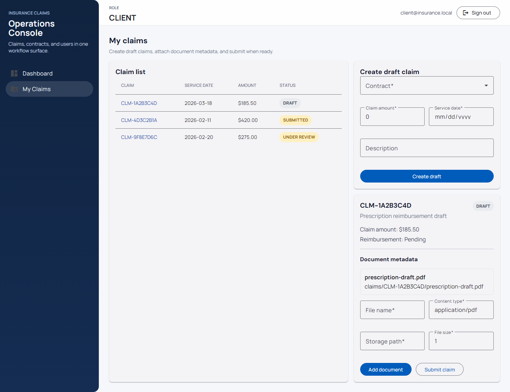
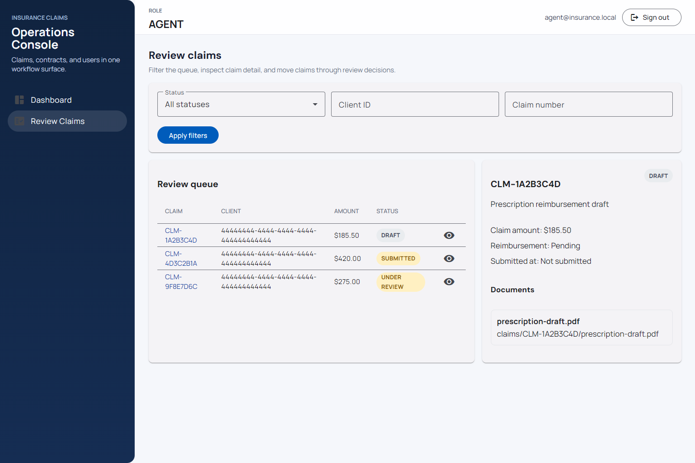

# Insurance Claims Management System

Enterprise-style reference implementation of a health insurance claims platform built with Spring Boot, Angular, PostgreSQL-oriented schema management, JWT security, and end-to-end project documentation.

## Implemented scope

### Backend

- Spring Boot 4 / Java 21 foundation
- PostgreSQL configuration and Flyway migrations
- JWT authentication and role-based authorization
- admin APIs for users, clients, and contracts
- claim workflow APIs for client submission and agent/admin review
- Swagger / OpenAPI exposure

### Frontend

- Angular 20 + Angular Material application shell
- role-aware navigation and route protection
- login screen
- admin dashboards and management screens for users, clients, and contracts
- client claim creation, document-metadata entry, and submission screens
- reviewer claim queue and decision screens

## Roles

- `ADMIN`: manages users, clients, contracts, and claim oversight
- `AGENT`: reviews submitted claims and records workflow decisions
- `CLIENT`: creates, tracks, and submits personal claims

## Screenshots

### Login



### Admin dashboard



### User management



### Contract management



### Client claims



### Reviewer queue



## Repository structure

```text
backend/   Spring Boot backend
frontend/  Angular frontend
docs/      Architecture, API, security, testing, and implementation notes
```

## Local development

### Backend

Backend verification:

```powershell
cd backend
.\mvnw.cmd test
```

For local UI exploration without PostgreSQL, the current frontend phase was verified against the backend running on the H2-backed `test` profile:

```powershell
cd backend
.\mvnw.cmd spring-boot:run -Dspring-boot.run.profiles=test -Dspring-boot.run.useTestClasspath=true
```

### Frontend

```powershell
cd frontend
npm install
npm start
```

The frontend dev server uses `proxy.conf.json` so browser requests to `/api` are forwarded to `http://localhost:8080`.

## Frontend verification

```powershell
cd frontend
npx ng test --watch false --browsers ChromeHeadless --progress=false
npm run build
```

## Current constraints

- document handling stores metadata only; binary upload is not implemented yet
- Docker Compose is still a placeholder
- CI/CD workflow files are not implemented yet

## Documentation map

- `docs/05-database-design.md`
- `docs/06-api-documentation.md`
- `docs/07-security-design.md`
- `docs/08-frontend-architecture.md`
- `docs/09-backend-architecture.md`
- `docs/10-testing-strategy.md`
- `docs/14-implementation-notes.md`
- `docs/Repo_Current_State.md`

## Next recommended phase

- Docker and local runtime packaging
- CI/CD pipeline documentation and workflow automation
